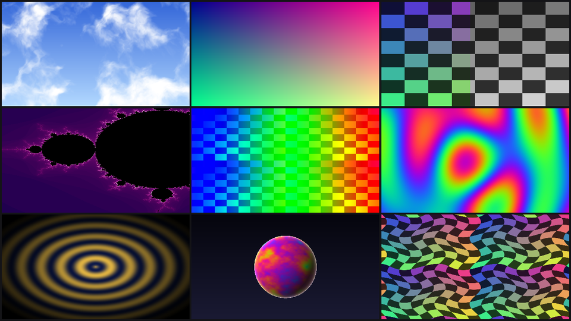

# StrideCSL

**Write [Stride](https://stride3d.net) shaders in C#**: typed, checked by the C# compiler, reloaded
live. The engine's own SDSL shaders are available as C# classes to inherit, call and modify, and any
`.sdsl` converts to C# and back.



> [!NOTE]
> **Experimental.** This project was written by Claude (Anthropic's AI) under my direction; I could
> not have built it on my own, so take it as an experiment rather than a finished tool. It is tested
> though: 469 of the engine's shaders go SDSL → C# → SDSL and compile to identical SPIR-V, and the
> CPU run of the demo is compared with the GPU's pixel by pixel.

```csharp
[Shader, Mixin(typeof(Global))]
public partial class DemoRings : ImageEffectShader
{
    [Stage]
    public override float4 Shading()
    {
        float2 p = streams.TexCoord - 0.5f;
        float d = length(p);
        float wave = 0.5f + 0.5f * sin(d * 60.0f - Time * 5.0f);
        float fade = saturate(1.0f - d * 1.6f);
        float3 color = lerp(new float3(0.05f, 0.1f, 0.3f), new float3(1.0f, 0.8f, 0.3f), wave) * fade;
        return new float4(color, 1.0f);
    }
}
```

is translated at build time, by a Roslyn source generator, to the SDSL the engine compiles:

```hlsl
shader DemoRings : ImageEffectShader, Global
{
    stage override float4 Shading()
    {
        float2 p = streams.TexCoord - 0.5;
        float d = length(p);
        float wave = 0.5 + 0.5 * sin(d * 60.0 - Time * 5.0);
        float fade = saturate(1.0 - d * 1.6);
        float3 color = lerp(float3(0.05, 0.1, 0.3), float3(1.0, 0.8, 0.3), wave) * fade;
        return float4(color, 1.0);
    }
};
```

## Features

- **Shaders as C# classes.** A `partial class` marked `[Shader]`, written with HLSL's types
  (`float3`, `float4x4`, `Texture2D<T>`, swizzles, intrinsics): IntelliSense, go to definition,
  refactoring, and compile errors before the shader compiler sees anything.
- **The whole engine, typed.** 476 of Stride's 479 shaders as C# classes (`Csl.Engine`), so a shader
  inherits `ImageEffectShader`, mixes in `ColorUtility` or calls `LuminanceUtils.Luma` with checked types.
- **Compute wrappers.** Each compute shader gets a generated `…Effect` class: one typed property per
  parameter, resource checks, `Dispatch(width, height)`.
- **SDSL → C#.** `csl convert` turns any `.sdsl`, the engine's included, into such a class, to read
  or to modify; the modified shader replaces the engine's under the same name.
- **Checked on the whole engine.** Every engine shader is converted SDSL → C# → SDSL and both
  versions are compiled by the engine; the SPIR-V is compared instruction for instruction.
- **Live reload** in the demo: save a shader, see it redrawn.
- **Run and debug on the CPU.** The same C# runs on the CPU (`Csl.Cpu`), engine code included,
  with the GPU's arithmetic as measured: Ctrl+click a pixel in the demo and step through its
  shader in the debugger.

## Requirements

Windows, the .NET 10 SDK and a Direct3D 11 GPU (feature level 11_0). Stride 4.4.0-beta8 comes from
NuGet on restore (`StrideVersion` in `Directory.Build.props`; `-p:StrideUseDevPackages=true` picks
the packages a local Stride checkout packs).

## Try it

```
git clone https://github.com/Nicogo1705/StrideCSL
cd StrideCSL
dotnet run --project demo/Csl.Demo
```

(or `Csl.Demo`, the first project of `StrideCSL.slnx`, from Visual Studio). A window shows the shaders of
`demo/Csl.Demo/Shaders/`, all written in C#. **Edit one and save while it runs: it is redrawn from the
new C#**, no restart. C# errors are printed in the console the way the build prints them, and the
previous version stays on screen until the file compiles again.

| Shader | Kind | Shows |
|--------|------|-------|
| `DemoGradient` | image effect | The simplest one: start here. Colour from the coordinates, `Time` from the engine's `Global`. |
| `DemoRings` | image effect | `length`, `sin`, `lerp`. |
| `DemoMandelbrot` | image effect | A loop with a `break`. |
| `DemoWobble` | image effect | Sampling `Texture0` (a checkerboard the demo makes). |
| `DemoLuma` | image effect | Calling an engine shader's static function: `LuminanceUtils.Luma`. |
| `DemoPlasma` | image effect, on `DemoTile` | Shared code: inherits `DemoTile`, calls `DemoCommon.Palette`. |
| `DemoClouds` | image effect, on `DemoTile` | Shared code: `DemoCommon`'s fractal noise, warped by itself. |
| `DemoSphere` | image effect, on `DemoTile` | Engine shaders both ways: `Math.RayIntersectsSphere` and `Math.PI` called by name (static), `Utilities.FresnelSchlick` through a mixin. |
| `DemoOverlay` | image effect, on `DemoTile` | An engine shader mixed in: `BlendUtils.Overlay` of the checkerboard over a gradient. |
| `DemoBlur` | compute | A gaussian blur over the whole window, one thread per pixel, run through its generated `DemoBlurEffect`. |
| `DemoTile` | shared, inherited | The base of the tiles above: `Shading` written once, calling `Color(p)` that each tile overrides; `Global` mixed in for `Time`; `Aspect`, set by the app. |
| `DemoCommon` | shared, called | Static functions any shader calls by name: `Hash`, `Noise`, `Fbm`, `Palette`. |

Keys: 1-9 one shader alone, 0 or space all of them, B the blur on and off, + and - its radius;
Ctrl+click a tile to run that pixel on the CPU, stopping in the debugger when one is attached (see
[Running shaders on the CPU](#running-shaders-on-the-cpu)).

The demo's launch profiles (Visual Studio's start button list, or `dotnet run --project demo/Csl.Demo --launch-profile "..."`):

| Profile | Does |
|---------|------|
| Gallery (GPU) | The window above. |
| Gallery computed on the CPU | The same gallery, every shader run by the CPU, animated at what the CPU manages (fps in the title). |
| Benchmark the CPU frames | 10 CPU frames one after the other, their cost and the median rate, window hidden. |
| Debug a pixel on the CPU | One pixel of DemoClouds on the CPU, no GPU: under the debugger it stops before it, F11 steps into the shader. |
| Compare CPU and GPU | Every demo drawn by both, compared; images and report in `cpu-check/`. |
| Screenshot, GPU / CPU | One frame saved as `shot-gpu.png` / `shot-cpu.png`, window hidden. |

Each image effect is an `ImageEffectShader` with `Shading()` overridden, directly or through
`DemoTile`; the tiles draw into a texture that `DemoBlur` blurs into the back buffer. A new
non-abstract `[Shader]` class in the folder gets a new tile; an abstract one is shared code.

### Sharing code between shaders

The same three ways as in SDSL, the engine's shaders and yours alike:

```csharp
// Inherit: DemoTile writes Shading once and calls Color, which each tile overrides.
[Shader]
public partial class DemoPlasma : DemoTile
{
    public override float3 Color(float2 p)
    {
        float v = sin(p.x * 8.0f + Time) + sin(length(p * 8.0f) - Time * 1.5f);
        return DemoCommon.Palette(v * 0.25f);   // call: a static function, by name
    }
}

// Mix in: the mixed-in shader's methods become the class's own.
[Shader, Mixin(typeof(BlendUtils))]
public partial class DemoOverlay : DemoTile
{
    public override float3 Color(float2 p)
    {
        float4 checker = Texture0.Sample(LinearRepeatSampler, streams.TexCoord * 2.0f);
        float4 gradient = new float4(DemoCommon.Palette(p.x * 0.4f + Time * 0.2f), 1.0f);
        return Overlay(gradient, checker).rgb;   // BlendUtils.Overlay, from the engine
    }
}
```

A shader whose only role is to be shared is an `abstract partial class`: `DemoCommon` holds `static`
functions, `DemoTile` a base class with `virtual` methods.

### How the live reload works

Saving recompiles the folder the way the build does (Roslyn, the Csl generator,
the translator: `LiveCompiler`), and each shader whose SDSL changed is registered again under a new
name (`DemoRings_2`), so the effect compiler has nothing cached for it. The shaders that use a changed
one follow it: editing `DemoCommon` redraws the four tiles that call it, their SDSL pointing to
`DemoCommon_2`. The keys of each new name (`DemoBlur_2.Radius`, `DemoTile_2.Aspect`) are registered as
aliases of the ones the build generated, so what the app sets keeps reaching the shaders; a parameter
added while the demo runs needs a rebuild.

`Csl.Demo --shot FILE.png [--time T] [--blur R]` compiles the shaders from their files, draws once, saves the
image and exits, the window hidden.

## Projects

| Project | Target | Role |
|---------|--------|------|
| `src/Csl.Generators` | netstandard2.0 | The code generation, both ways. As a Roslyn generator: C# `[Shader]` classes → SDSL, `*Keys` classes and compute wrappers; the stubs every shader class gets. As a library: the SDSL parser (whole files, bodies, preprocessor structure), the SDSL → C# converter and its compiler-guided fixes. |
| `src/Csl.Types` | net10.0 | What shader code is written with: `Csl.Types` (every HLSL scalar, vector and matrix type with HLSL's conversions and swizzles, the resources, the intrinsics), the attributes for what SDSL declares and C# has no keyword for, the `Sdsl` markers; and `Csl.Cpu`, which runs that code on the CPU. No Stride dependency. |
| `src/Csl.Engine` | net10.0 | The engine's shaders (476 of 479) as `[Shader(External = true)]` classes: what C# shaders inherit and call. 474 carry their bodies, for the CPU; the GPU compiles the engine's `.sdsl`. Written by `csl engine`. |
| `src/Csl.Runtime` | net10.0 | Running C# compute shaders: `ComputeEffect` wrappers, `ShaderContext`, allocation helpers, `ShaderSourceRegistry` (hands the generated SDSL to the effect compiler). |
| `src/Csl.Tool` | net10.0, exe `csl` | `csl convert`: `.sdsl` files, or engine shaders by name, to C#. `csl engine`: regenerates `Csl.Engine`. |
| `demo/Csl.Demo` | net10.0, exe | The demo: C# shaders in a window, reloaded on save; also run on the CPU, pixel by pixel under the debugger, and compared with the GPU. |
| `tests/Csl.TestApp` | net10.0, exe | The test bench, for working on StrideCSL itself: the whole-engine round trip checked by the engine compiler, C# shaders run on the GPU and checked, the GPU's arithmetic measured, the reserved names probed. |
| `tests/Csl.Tests` | net10.0, xunit | Unit tests of the generator, the wrappers, the analyzer, the runtime and the CPU run, without a GPU. |

A project that writes shaders in C# references:

```xml
<ProjectReference Include="..\StrideCSL\src\Csl.Types\Csl.Types.csproj" />
<ProjectReference Include="..\StrideCSL\src\Csl.Engine\Csl.Engine.csproj" />
<ProjectReference Include="..\StrideCSL\src\Csl.Runtime\Csl.Runtime.csproj" />
<ProjectReference Include="..\StrideCSL\src\Csl.Generators\Csl.Generators.csproj" OutputItemType="Analyzer" ReferenceOutputAssembly="false" />
```

## C# to SDSL: writing shaders in C#

```csharp
using Csl; using Csl.Engine; using Csl.Types; using static Csl.Types.Intrinsics;

/// <summary>Output[i] = ToLinear(i / 63): an engine shader mixed in, its method called with types.</summary>
[Shader, NumThreads(64), Mixin(typeof(ColorUtility))]
public partial class CslColorLinear : ComputeShaderBase
{
    [Stage] public RWBuffer<float> Output;

    public override void Compute()
    {
        uint i = streams.DispatchThreadId.x;
        Output[i] = ToLinear(i / 63.0f);
    }
}
```

The generator writes, next to the class, the SDSL (`CslColorLinear.SdslSource`, registered at
start-up in `ShaderSourceRegistry`), `CslColorLinearKeys` in the shape the engine gives a `.sdsl`,
and for a compute shader `CslColorLinearEffect`, a typed wrapper:

```csharp
using var output = Csl.Buffers.NewTyped<float>(GraphicsDevice, 64, CslColorLinearEffect.Slots.Output);
using var effect = new CslColorLinearEffect(Services) { Output = output };
effect.Dispatch(64);
```

A shader of any other kind (a material feature, an image effect) is used by name like any engine
shader: `new ImageEffectShader(nameof(CslInvert))`.

C# has one base class where SDSL has many: the first SDSL base is the C# base, the others are
`[Mixin(...)]`. The generated half of every shader class declares the mixins' members as stubs (so
they are in scope, typed) and `streams`, typed as the class itself, so `streams.Position` reads as in
SDSL and is checked.

### Extending an engine shader

`Csl.Engine` has the engine's shaders as C# classes; inherit one, override its methods:

```csharp
[Shader]
public partial class CslInvert : ImageEffectShader
{
    [Stage]
    public override float4 Shading()
    {
        float4 color = Texture0.Sample(PointSampler, streams.TexCoord);   // Texturing's, through SpriteBase
        return new float4(1.0f - color.rgb, color.a);
    }
}
```

A method of a mixin (not of the C# base class) is overridden with `[Override]`; a mixin's method
reached through `base` is `Sdsl.Base(this).Method()`.

### Modifying an engine shader

`csl convert --engine LuminanceUtils --namespace My.Shaders --out Shaders` writes the engine's
`LuminanceUtils` as a full C# class, bodies included. Edit it; it keeps the engine's SDSL name, so
once registered (at the first `ComputeEffect`, or `ShaderSourceRegistry.InstallInto(effectSystem)`)
it replaces the engine's shader in every effect that uses it. `tests/Csl.TestApp/Modified` does this
and the gpu tests check the result.

## SDSL to C#: converting shaders

```
csl convert Shaders/MyShader.sdsl --out Shaders/Cs              # a project's shaders, bodies included
csl convert --engine ComputeColorTexture --out Shaders/Cs        # an engine shader, to modify
csl convert Shaders/MyShader.sdsl --declarations --out External  # external classes, to extend .sdsl shaders from C#
```

The converter parses whole files (bodies, the `#if` structure, comments and doc comments), writes C#
from the tree, then compiles it with the generator and makes explicit, error after error, what HLSL
does implicitly and C# does not accept. Each fix is a marker the translator leaves out, so the SDSL
the C# translates back to is the original: `Sdsl.Implicit<float3>(v)` is `v` (a narrowing, an int
used as a condition), `= default` on a local is no initializer, `Sdsl.Undefined(out x)` is nothing.

Converting `ShadingBase` gives, for instance:

```csharp
[Shader]
[Define("STRIDE_RENDER_TARGET_COUNT", "1", If = "!defined(STRIDE_RENDER_TARGET_COUNT)")]
public abstract partial class ShadingBase : ShaderBase
{
    [Compose] public ComputeColor ShadingColor0;
    [If("STRIDE_RENDER_TARGET_COUNT > 1"), Compose] public ComputeColor ShadingColor1;
    ...
    [Stage]
    public override void PSMain()
    {
        base.PSMain();
        streams.ColorTarget = this.Shading();

        if (Sdsl.If("STRIDE_RENDER_TARGET_COUNT > 1"))
        {
            streams.ColorTarget1 = ShadingColor1.Compute();
        }
        ...
```

and back exactly the SDSL it came from.

### What C# says for what SDSL says

| SDSL | C# |
|------|----|
| `shader X : A, B<T, 2>, C` | `[Mixin(typeof(B), Generics = "T, 2"), Mixin(typeof(C))] partial class X : A`; generic first base: `[Shader(BaseGenerics = "...")]` |
| `shader X<LinkType TName, int TCount>` | `[Generic] public static LinkType TName; [Generic] public static int TCount;` |
| `internal shader X` | `[Shader(Internal = true)]` |
| `stage`, `stream T x : SEM`, `patchstream`, `compose`, `groupshared`, `clone` | `[Stage]`, `[Stream("SEM")]`, `[PatchStream]`, `[Compose]`, `[GroupShared]`, `[Clone]` |
| `static const T x = v;` | `public const T x = v;`, or `public static readonly T x = v;` for vectors |
| `cbuffer PerMaterial { ... }`, `rgroup`, `tbuffer` | `[CBuffer("PerMaterial")]` on each member (`NewBlock = true` for a second block of the same name) |
| `[Link("X")]`, `[Color]`, any other attribute | `[Link("X")]`, `[Color]`, `[Hlsl("maxvertexcount(3)")]` |
| `T x[N]`, `compose T x[]` | `[Size("N")] T[] x`, `[Compose] T[] x` |
| `T x : SEMANTIC`, `nointerpolation`, parameter `triangle`, `const` | `[Semantic("SEMANTIC")]`, `[Modifiers("nointerpolation")]` |
| `SamplerState S { Filter = ...; }` | `[Sampler(Filter = "...", AddressU = "Wrap")] SamplerState S` |
| `#if C` around a member | `[If("C")]`; versions of one member under different `#if`: `[Variant("SDSL", If = "C")]` |
| `#define N V`, `#ifndef N / #define N V / #endif`, `#error` | `[Define("N", "V")]`, `[Define("N", "V", If = "!defined(N)")]`, `[PreprocessorError("...")]` |
| `#if` / `#elif` / `#else` in a body | `if (Sdsl.If("C")) { } else if (Sdsl.If("D")) { } else { }` |
| a macro in an expression, a macro statement | `Sdsl.Macro("N")`, `Sdsl.MacroStatement("N");` |
| `override` a mixin's method | `[Override]` (C#'s `override` only reaches the C# base class) |
| `streams.x`, `streams.TName` (MemberName), a stream the effect brings | `streams.x`, `streams[TName]`, `streams["x"]` |
| `v.TName` (MemberName), `m._m00_m11` | `Sdsl.Member(v, TName)`, `Sdsl.Member(m, "_m00_m11")` (assignable) |
| `Shader.Method()` without an instance | `Sdsl.Static<Shader>().Method()` (a static method is called directly) |
| `in`, `out`, `inout` | `in`, `out`, `ref` |
| `[unroll]`, `[loop]`, `[branch]`, `[flatten]`, `[fastopt]` | `Unroll();`, `Loop();`, `Branch();`, `Flatten();`, `Attribute("fastopt");` before the statement |
| `discard;` | `discard();` |
| `float3(a, b, c)`, `(float3)x`, `(S)0` | `new float3(a, b, c)`, `(float3)x`, `default(S)` |
| `const` / `static const` locals | `const` when C# can, else `Sdsl.Const(v)` / `Sdsl.StaticConst(v)` |
| `Input`, `Output`, `TriangleStream<T>`… | `[Type("TriangleStream<Output>")] dynamic` |
| `2.0`, `2.0f`, `1u` | `2.0f`, `2.0f`, `1u` (`0u` and `0x10u` are written `(uint)0`, `(uint)0x10`: the 4.4 parser rejects them) |

The HLSL types follow HLSL's conversions: widening (bool < int < uint < half < float < double, same
size) is implicit, narrowing and truncation are explicit, as HLSL only warns about them. Vectors take
any mix of parts in their constructors (`new float4(v.xyz, 1)`), scalars have swizzles (`f.xxx`, C#
14 extension members), matrices have `m[row]`, `m._m01`, `m._12`.

## Running shaders on the CPU

`Csl.Cpu` (in Csl.Types) runs a C# shader as the CPU's own code, to step through it in a debugger:
the shader's methods, the engine's (Csl.Engine carries the bodies of the 474 engine shaders that
convert; the GPU still compiles the engine's `.sdsl`), the intrinsics and the resources.

```csharp
var run = new CpuImageEffect(typeof(DemoClouds), 320, 180) { Break = true };
run.Set("Time", 2f);
run.Set("Texture0", new Texture2D(new CpuTexture(256, 256).FillRgba8(pixels)));
CpuTexture image = run.Draw();          // every pixel
float4 one = run.DrawPixel(120, 45);    // one, stopping in the debugger right before it

var blur = new CpuComputeShader(typeof(DemoBlur));
blur.Set("Input", new Texture2D<float4>(input)).Set("Output", new RWTexture2D<float4>(output));
blur.Dispatch(40, 23);
```

- **Pixels** run in 2x2 quads: `ddx`/`ddy` (coarse, as fxc compiles them), `fwidth` and `Sample`'s
  mip level come from the neighbours, each lane then a thread in lockstep with the others;
  `discard` keeps the lane running for them. **Compute** groups run their threads in lockstep at
  `GroupMemoryBarrierWithGroupSync`, one group after the other for `[GroupShared]` statics.
- **Resources** given CPU data (`new Texture2D(cpuTexture)`, `new RWStructuredBuffer<T>(array)`) are
  read and written; filtering follows Direct3D 11 (address modes on texel indices, 8-bit linear
  weights, level from the longest derivative), writes round to the format. Samplers take their
  `[Sampler]` description, Stride's defaults otherwise.
- **Mixins**: a call through a mixin stub runs the mixin's own method on an instance kept for the
  shader, members of the same name shared both ways, as SDSL merges them. `Sdsl.If`/`Sdsl.Macro`
  read the run's `Macros` (Direct3D 11's by default).
- **The GPU's arithmetic**, measured (`Csl.TestApp gpu`, `CslPrecision`): `dot` as a chain of FMAs,
  `lerp` and `mad` fused, `sin`/`cos` reduced in turns with the 32-bit 1/2π rounded toward zero,
  `min`/`max`/`saturate` of a NaN as D3D. Bit-exact but for `sin`/`cos`/`exp`/`log` (~1e-7) and
  `rsqrt`/`sqrt` (1-2 ulps), the hardware's own approximations.

Lanes first run straight on one thread each; only a derivative or a barrier makes the run start that
quad or group again in lockstep (and every one after it), so a shader pays for lockstep only if it
needs it. Groups without group-shared memory, and rows of quads, run in parallel.

In the demo: `Csl.Demo --cpu` computes the gallery on the CPU in the background and draws each frame
as it comes, animated, the rate in the title (1280x720 on 28 threads: about 1.4 frames per second,
tiles 270 ms, blur 460 ms: the shaders' own maths, DemoClouds' 40 `sin` a pixel and the blur's 81
`exp`); `--cpu-bench N` measures it. In the GPU gallery, Ctrl+click on a tile runs that pixel on the
CPU from the C# just saved and prints both colours, stopping in the debugger when one is attached
(then F11 into the shader, whose file opens editable); `--debug-pixel NAME X Y` does it without a
GPU; `--cpu-check DIR` draws every demo on both and compares them. On Direct3D 11, 7 of the 10 demos
match to one 8-bit step; over the whole frame, 96 % of the pixels.

What the CPU cannot reproduce, because the GPU does not run the C# as written:

- **Contraction**: the compiler fuses `a * b + c` anywhere into an FMA (one rounding instead of two)
  and folds constants across expressions (`x * 127.1 + x * 0.5 * 311.7` became `x * 282.95`). A few
  ulps, invisible, except where a result amplifies them: a hash (`frac(sin(x) * 43758.5)`), an
  escape-time fractal's boundary (DemoClouds, DemoSphere, DemoMandelbrot).
- The hardware's `sin`, `exp`, `rsqrt`, and the rasterizer's interpolation of `TexCoord` (1 ulp,
  which a rounding boundary can show as a line one step off).
- `Sdsl.Ref` and writes through `Sdsl.Member` write a copy; a mixin calling back a method the shader
  overrides runs its own; cube and multisampled textures, append/consume buffers and atomics on
  resource elements are GPU only (they throw).

## Validation

`tests/Csl.TestApp` checks StrideCSL itself; nothing here is needed to use it. `dotnet run --project tests/Csl.TestApp -- <command>`:

| Command | Does |
|---------|------|
| `parse` | Parses every engine shader with the full parser. |
| `convert [--out DIR]` | Converts every engine shader SDSL → C# → SDSL; writes both and a report of what fails. |
| `roundtrip [--out DIR]` | Compiles each converted engine shader with the engine's SDSL compiler (`ShaderMixer`, to SPIR-V) from its original source and from its round trip (its bases round-tripped too) and compares the SPIR-V without debug instructions. A shader without an entry point is hosted after `ShaderBase` or `ComputeShaderBase`; a generic one is instantiated with sample arguments. A difference is traced to the base that causes it. |
| `compile NAME...` | Compiles engine shaders (and this app's C# shaders), mixed in this order. |
| `gpu` | A code-only Stride game (hidden window) that runs the C# shaders of `Shaders/` and checks what they compute against the CPU: a shader written in C#, an engine shader mixed in, an engine shader replaced by its modified C#, the engine's `ImageEffectShader` extended; and `CslPrecision`, the GPU's arithmetic against the CPU run's, in ulps per operation. Prints PASS/FAIL. |
| `names [NAME...]` | Compiles each candidate name (keywords, types, intrinsics) as a local, parameter, method, variable and field, to SPIR-V then Direct3D 11 on the CPU (SPIRV-Cross, fxc): what CSL110 reports. |

Results on Stride 4.4.0-beta8 (479 shaders in the packages):

- **474** convert and translate back; the SPIR-V of **469** is identical to the original's, none
  differs. The other 5 are `ComputeColorTexture*`, whose `Texture2D` generic parameter the engine's
  new compiler does not implement (`NotImplementedException`), in their original form too.
- **476** are in `Csl.Engine`, 474 with their bodies.
- Not converted: `FXAAShader` and `SubsurfaceScatteringBlurShader` (function-like macros) and
  `SSLRBlurPass` (`#if` inside an initializer list), which are the three missing from `Csl.Engine`;
  `PositionStream` (the whole shader under `#if`/`#else`) and `LightProbeShader` (a member and a
  local declared under `#if`), in `Csl.Engine` as declarations.

On the GPU (`gpu`, Direct3D 11, feature level 11_0): the five C# shaders compute what the CPU expects, the modified
`LuminanceUtils` replacing the engine's in the effect that calls it; `CslPrecision` gives what
[Running shaders on the CPU](#running-shaders-on-the-cpu) says of the GPU's arithmetic.

`tests/Csl.Tests` (`dotnet test`) checks the generator on sample shaders, the wrappers against the
engine, compiles the generated SDSL with the engine compiler, and runs shaders on the CPU
(derivatives, discard, an engine mixin, group-shared memory across a barrier).

## Compute wrappers

For `shader VoxelWaterStep : ComputeShaderBase, VoxelWaterBricks`, the generator emits
`VoxelWaterStepEffect`:

- **Base class**: the wrapper of the first base declared in the project (abstract, carrying its
  parameters once for every pass that mixes it in), or `Csl.ComputeEffect`. A shader is "compute"
  when its inheritance reaches `ComputeShaderBase`.
- **Constructor**: `new VoxelWaterStepEffect(services, threadNumbers)`, or without thread numbers for
  a C# shader with `[NumThreads]`.
- **One property per parameter**, typed as the engine's key (`float`, `Int3`, `Vector3`, `Texture?`,
  `Buffer?`), documented from the member's `///`.
- **`Slots`**: one `ResourceSlot` per resource with its HLSL type, element type and the access the
  shader makes of it (read from the bodies).
- **`Dispatch(Int3 cells)`**: `ceil(cells / threadNumbers)` groups per axis.

`Textures.New3D<T>(device, size, slots...)`, `Buffers.NewTyped<T>`, `NewStructured<T>`, `NewRaw`
allocate with the format of the element type and the views the slots need; `MipViews()`,
`PingPong<T>`, `UploadRegion`, `FillRegion` cover the rest.

### Diagnostics

| Id | Says |
|----|------|
| CSL001–004 | A `.sdsl` declaration the wrapper parser did not understand, a parameter type or array without a C# key type, a shader declared twice. |
| CSL010 | A texture read and written through its RW view with a format Direct3D 11 cannot load from. |
| CSL100–109 | C# that has no SDSL equivalent, on its line: a non-partial shader class, a statement or type outside the subset, a call outside the intrinsics and shader methods, a base that is not a shader, a C# shader named like a `.sdsl`. |
| CSL110 | A name the SDSL parser takes for a keyword or a type (`sample`, `point`, `line`, `half`, `texture`, `float2`, `@if`, `rgroup`…), or `@base`/`@this`/`streams` as a local, parameter or shader variable: C# accepts it, the engine then fails with a parse error on another token. The list is measured by `Csl.TestApp names`. |
| CSL111 | A method that calls itself, directly or through others (the cycle is in the message): GPU code has no call stack. |
| CSL112 | A shader parameter written (`Scale = 2`, `Offset.x += 1`): parameters live in constant buffers, read-only on the GPU. Streams, `static` and `[GroupShared]` fields, and the elements of RW resources can be written. |
| CSL113 | `ddx`, `ddy`, `fwidth`, `discard`, `clip`, or a `Sample` that picks its mip level from derivatives, in a compute shader: pixel shaders only. |
| CSL114 | (warning) A `return` inside a loop: Direct3D 11 can refuse it (X4555) when the entry point also returns early. |
| CSL115 | `[NumThreads]` outside Direct3D's limits: 1 to 1024 threads per group, at most 64 on Z. |
| CSL116 | (info) A compute shader without `[NumThreads]`: its wrapper then needs the thread numbers. |
| CSL117 | (warning) A shader named like an engine shader, which it then replaces in every effect; `[Shader(Replaces = true)]` when that is the point. |
| CSL118 | (warning) An integer division inside a float vector constructor, `new float3(i / 4, 0, 0)`: Stride 4.4 computes it in float. |

CSL110 to CSL115 and CSL118 were each seen failing on Stride 4.4, as a parse error, a SPIR-V validation
error, an fxc error or a wrong result, far from the line that causes it.

## Limits

- Function-like macros, `#if` inside an expression, and a whole shader under `#if` are not converted.
- A local declared in one `#if` branch and used after it does not compile in C# (the branch is a block).
- `[Variant]` versions of a member are SDSL text: C# types the member by its main version only.
- The in-memory registration reaches the local `EffectCompiler` through a protected property, by
  reflection; a remote compiler cannot take C# shaders.
- The conversion needs Roslyn 5 (C# 14, for the scalar swizzles): `csl` and the test app carry it;
  the generator itself builds against Roslyn 4.12 and runs in any recent SDK.

## License

[MIT](LICENSE). `Csl.Engine` declares the engine's shaders from Stride's sources, which are MIT
licensed by the .NET Foundation and contributors; their headers are kept.
